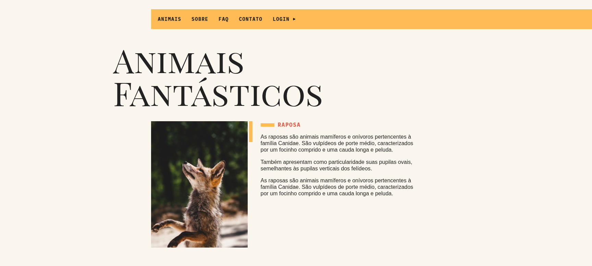
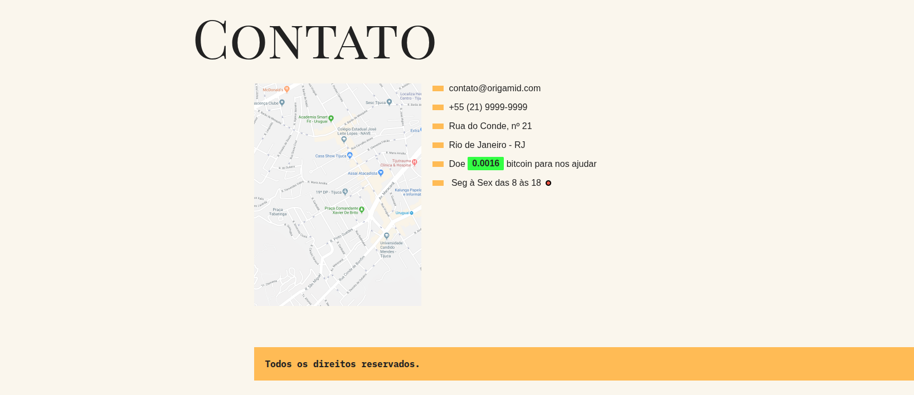

# 🐾 Animais Fantásticos

Projeto desenvolvido durante o curso de **JavaScript Completo ES6** da Origamid
O objetivo é praticar **JavaScript moderno (ES6+)**, **modularização**, consumo de **APIs** e organização de código com **Webpack** e **Babel**.

---

## 🚀 Tecnologias Utilizadas

- **HTML5**
- **CSS3**
- **JavaScript (ES6+)**
- **Webpack** (empacotador de módulos)
- **Babel** (compatibilidade de código)
- **ESLint + Prettier** (padronização de código)

---

## 🖼️ Preview

<p align="center">
  <br>
  <br>
  
</p>

---

## 🛠️ Funcionalidades

✅ **Scroll Suave** – navegação com rolagem animada  
✅ **Accordion** – abre/fecha listas de conteúdo  
✅ **Tabs (Navegação por Abas)** – exibe conteúdos diferentes sem recarregar a página  
✅ **Modal** – janela de interação para destaque de informações  
✅ **Tooltip** – dicas ao passar o mouse em elementos  
✅ **Scroll Animado** – animação de elementos ao entrar na tela  
✅ **Menu Dropdown** – menus suspensos  
✅ **Menu Mobile** – versão responsiva para dispositivos móveis  
✅ **Funcionamento** – mostra se o site está aberto de acordo com o horário configurado  
✅ **Slider/Carrossel** – navegação entre elementos de forma interativa  
✅ **Consumo de API**:  
   - **Animais** → busca dados do arquivo `animaisapi.json` e renderiza na tela  
   - **Bitcoin** → busca o preço atual do Bitcoin pela [Blockchain API](https://blockchain.info/ticker)  

---

## 📦 Instalação e Uso

1. Clone este repositório:
   ```bash
   git clone https://github.com/seu-usuario/animais-fantasticos.git
    ```


Acesse a pasta do projeto:

```bash
cd animais-fantasticos
```

2.Instale as dependências:

```
bash
npm install
Execute em modo desenvolvimento (com atualização automática):
```

```
bash
npm run dev
```

Para gerar a versão final de produção:

```
bash
npm run build
```